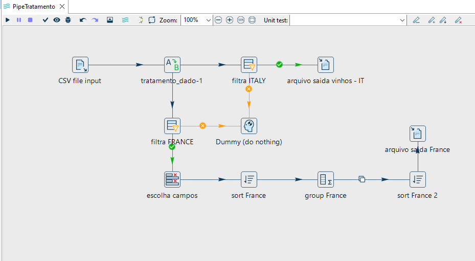

# 🍷 Projeto Pipeline de Dados de Vinho com Apache Hop 🚀 

<p align="center">
  <a href="https://hop.apache.org/" target="_blank">
    
  </a>
</p>

Bem-vindo ao projeto de **Pipeline de Dados de Vinho**! Este repositório demonstra, de forma prática, a construção de um pipeline ETL (Extract, Transform, Load) utilizando a poderosa ferramenta **Apache Hop**. O objetivo é processar, limpar e transformar dados relacionados a vinhos, preparando-os para análises futuras ou armazenamento estratégico. 🍾

Este projeto foi desenvolvido como parte dos aprendizados adquiridos no curso **"Super Academia Engenharia de Dados - 9 cursos em 1"**, na plataforma **[Udemy](https://www.udemy.com/)**, ministrado pelo professor [Grimaldo Oliveira](https://www.linkedin.com/in/grimaldo/).

<br>


## 🎯 Objetivo do Projeto

Este pipeline demonstra como o Apache Hop pode ser utilizado para orquestrar fluxos de dados complexos de forma visual e eficiente, seguindo as seguintes etapas:

1. **Extração (Extract):** Leitura de dados brutos de vinhos a partir de um arquivo CSV.
2. **Transformação (Transform):** Aplicação de regras como limpeza, enriquecimento, formatação, classificação e roteamento dos dados.
3. **Carga (Load):** Armazenamento dos dados processados em arquivos `.txt`, separados por país, prontos para análises e uso futuro.

<br>

## 🔌 Plugins e Componentes do Pipeline

O pipeline utiliza os seguintes plugins e componentes do Apache Hop:

- **``CSV File Input``:** Para leitura dos dados de entrada em formato 
- **``Select Values``:** Para seleção e renomeação de campos.
- **``Filter Rows``:** Para filtragem de registros com base em condições específicas.
- **``Text File Output``:** Para escrita dos dados transformados em arquivos de saída.

<br>


## 🛠️ Ferramentas Utilizadas

- **Apache Hop:** Plataforma de integração e orquestração de dados, open source, flexível e baseada em interface visual.
- **Java JDK:** Necessário para executar o Apache Hop.
- **Sistema Operacional:** Windows (utilizado durante o desenvolvimento do projeto).
- **Git + GitHub:** Para versionamento e hospedagem do projeto.

<br>

## ✨ Visualização do Pipeline

Uma imagem vale mais que mil palavras! Veja abaixo o diagrama do pipeline completo construído no Apache Hop:

<p align="center">
  
</p>

<br>


## 🚀 Como Executar

### 1. Pré-requisitos

- Java JDK/JRE instalado.
- [Apache Hop](https://hop.apache.org/) instalado e configurado (versão GUI, preferencialmente em ambiente Windows).

### 2. Clonar o repositório

```bash
    git clone https://github.com/MarcosWinther/project-apache-hop-wine-data-pipeline.git

    cd project-apache-hop-wine-data-pipeline
```

### 3. Abrir o Pipeline no Apache Hop GUI
- Inicie o Apache Hop (hop-gui.bat).
- Vá em File > Open e selecione o arquivo `PipeTratamento.hpl` dentro da pasta `hop/pipelines`.

### 4. Verificar Caminhos
- Certifique-se de que os caminhos no step CSV file input apontam para `input/vinhos_mundo.csv`.
- Confira também os paths nos steps Text file output, que devem gerar os arquivos na pasta `output/`.

### 5. Executar
- Com o pipeline aberto no Hop GUI, clique no botão Run (ícone ▶️).
- Acompanhe os logs, métricas e arquivos gerados na pasta de saída.

<br>


## 🙏 Agradecimentos

Um agradecimento especial ao professor [Grimaldo Oliveira](https://www.linkedin.com/in/grimaldo/) pela excelência no ensino e por compartilhar seu vasto conhecimento no curso **"Super Academia Engenharia de Dados - 9 cursos em 1"** na Udemy, que foi fundamental para o desenvolvimento deste projeto.

<br>


## 👨‍💻 Expert

<p>
    
    <p>&nbsp&nbsp&nbspMarcos Winther<br>
    &nbsp&nbsp&nbsp
    <a href="https://github.com/MarcosWinther">
    GitHub</a>&nbsp;|&nbsp;
    <a href="https://www.linkedin.com/in/marcoswinthersilva/">LinkedIn</a>
    </p>
</p>
<br/><br/>

---

⌨️ com 💜 por [Marcos Winther](https://github.com/MarcosWinther)
